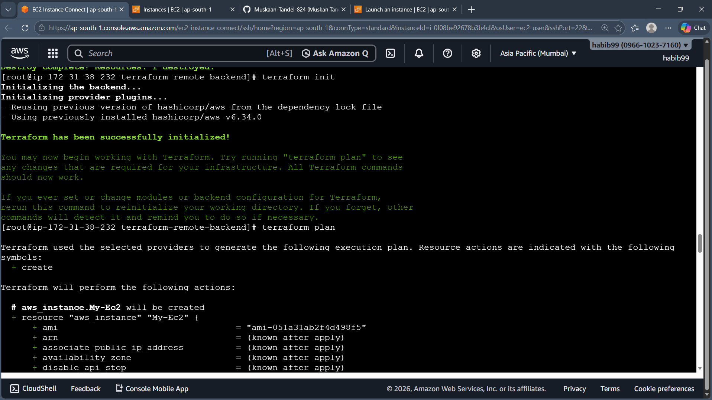
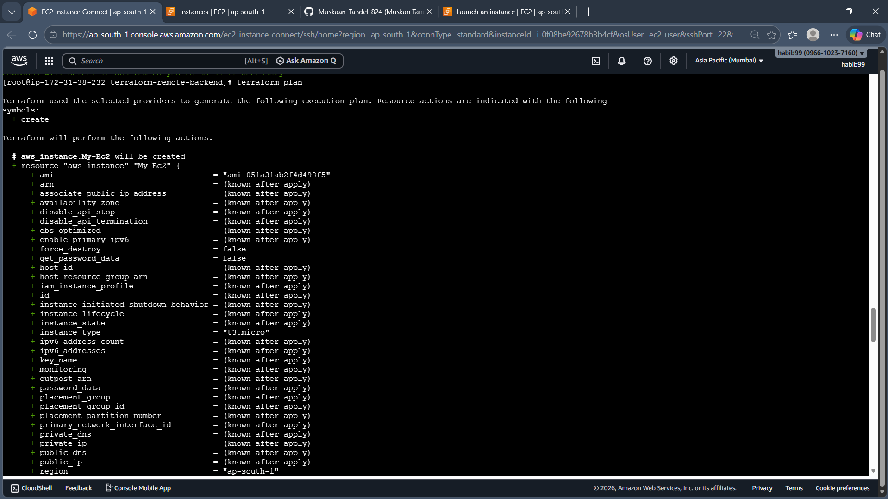
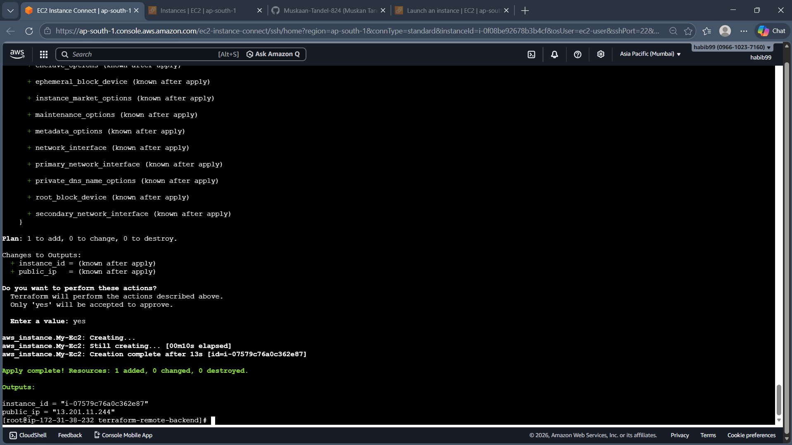
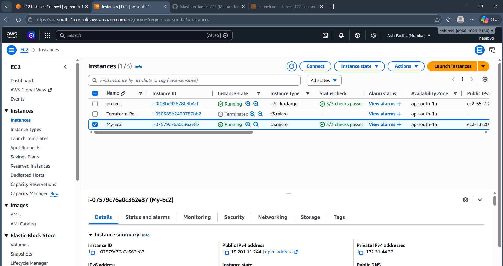
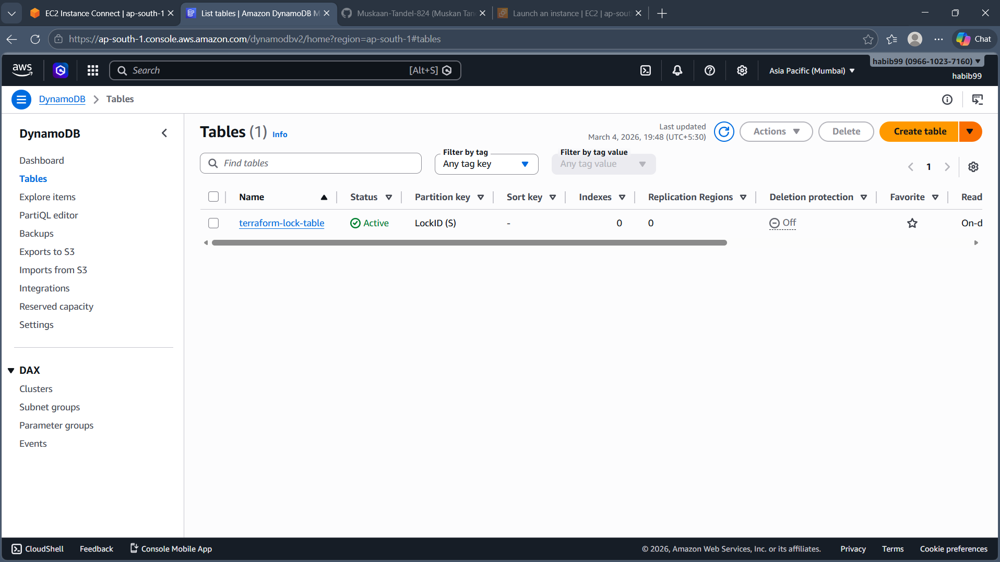
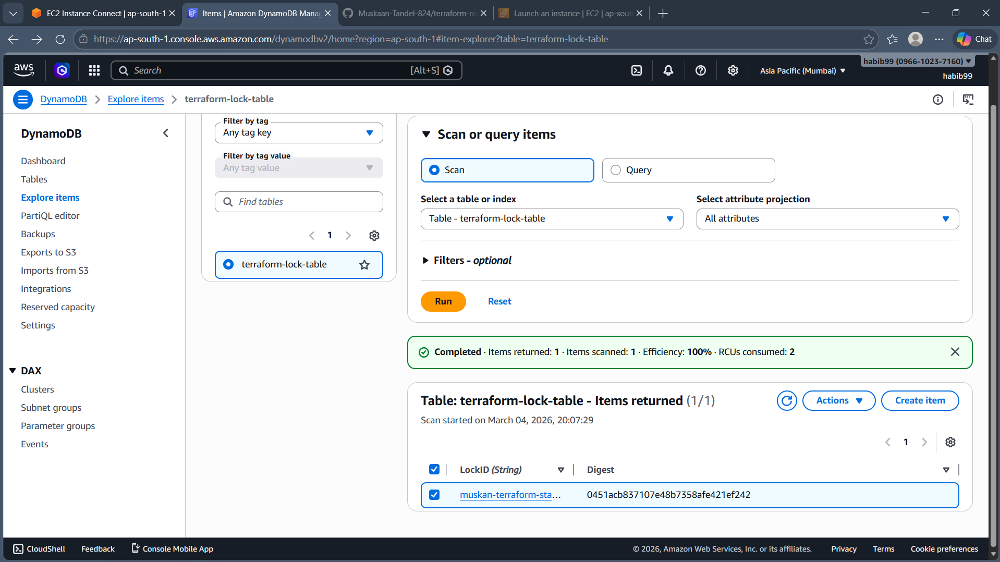
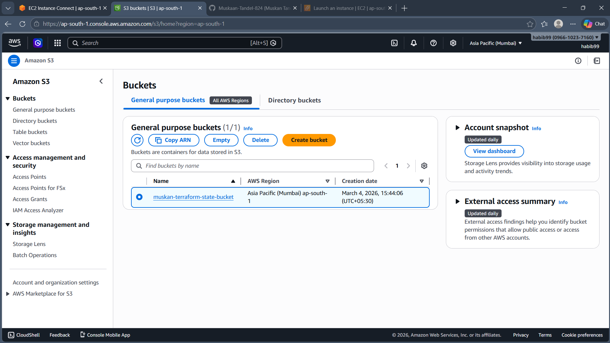

# 🚀 Infrastructure Automation on AWS using Terraform

### Remote Backend + State Locking Implementation

---

## 📌 Project Overview

This project demonstrates production-ready Infrastructure as Code (IaC) implementation using **Terraform** with a remote backend configuration on AWS.

Terraform was executed from an **Amazon EC2** instance to provision and manage AWS infrastructure following real-world DevOps best practices.

The project includes:

* Remote state storage using S3
* State locking using DynamoDB
* Modular Terraform configuration using variables and outputs
* Clean infrastructure lifecycle management

---

## 🎯 Project Objectives

* Automate AWS resource provisioning using code
* Eliminate local state file conflicts
* Enable safe team collaboration
* Implement production-style backend configuration
* Follow real DevOps infrastructure workflow

---

## 🏗 Architecture Workflow

EC2 (Terraform Execution Environment)
↓
Terraform Configuration
↓
S3 Bucket (Remote State Storage)
↓
DynamoDB Table (State Locking)
↓
EC2 Infrastructure Provisioned

---

## 🛠 Technologies & Services Used

* **Terraform**
* **Amazon EC2**
* **Amazon S3**
* **Amazon DynamoDB**
* AWS CLI
* Linux (Amazon Linux)

---

## 📂 Project Structure

```
terraform-remote-backend/
 ├── main.tf
 ├── variables.tf
 ├── terraform.tfvars
 └── outputs.tf
```

---

## 🔐 Backend Configuration

Terraform backend configured using S3 and DynamoDB:

* S3 stores the Terraform state file remotely
* DynamoDB ensures state locking during execution
* Encryption enabled for secure storage

---

## ⚙️ Key Features Implemented

✅ Remote backend configuration
✅ Centralized state management
✅ State locking mechanism
✅ Modular Terraform design
✅ Infrastructure lifecycle management (init, plan, apply, destroy)
✅ Executed from cloud-based EC2 environment

---

## 🚀 Execution Commands

Initialize Terraform:

```
terraform init -reconfigure
```

Validate configuration:

```
terraform validate
```

Preview execution plan:

```
terraform plan
```

Apply infrastructure:

```
terraform apply
```

Destroy infrastructure:

```
terraform destroy
```

---

## 🔎 State Management Verification

* Terraform state file stored in S3
* DynamoDB table creates lock entry during apply
* Lock prevents concurrent infrastructure modification
* Safe for multi-user collaboration

---

## 💡 Why This Project is Important

In real production environments:

* Multiple engineers manage infrastructure
* Local state files create conflicts
* Simultaneous execution can corrupt resources

This project demonstrates industry-standard backend configuration to ensure:

* Consistency
* Reliability
* Scalability
* Secure infrastructure provisioning

---

## 📈 Production Relevance

This setup reflects real-world DevOps practices used in organizations for:

* CI/CD pipeline integration
* Infrastructure automation
* Team-based cloud management
* Scalable cloud provisioning.

##ScreenShots :








